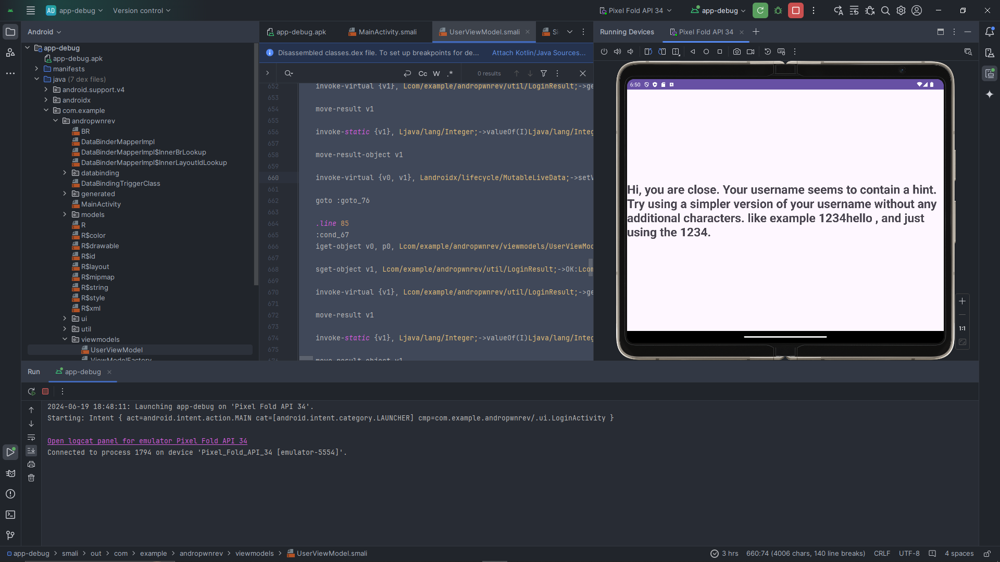
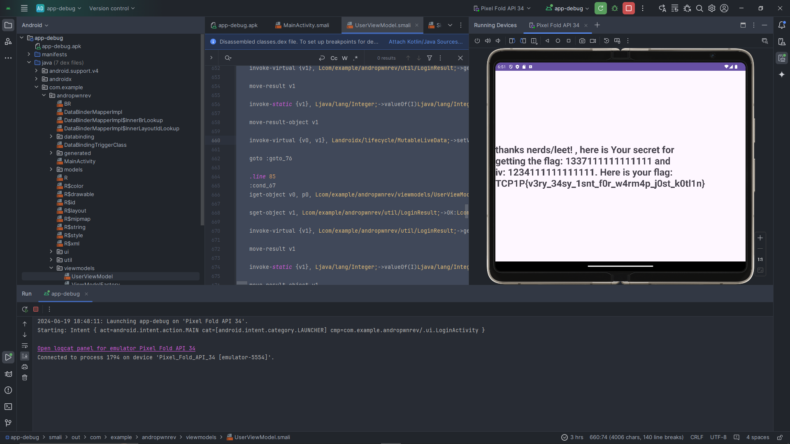
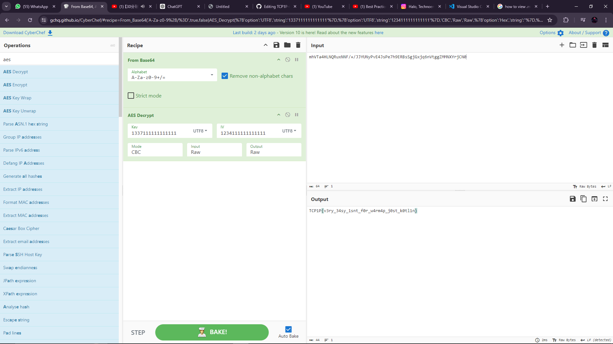

## Summary

disini kita mendapatkan .apk , lalu kita static analysis ( bisa menggunakan android studio maupun jadx-gui ), terus analisa dibagian function validateUsername yang ada di viewModels

```java
.method private final validateUsername()V
    .registers 6

    .line 80
    nop

    .line 82
    iget-object v0, p0, Lcom/example/andropwnrev/viewmodels/UserViewModel;->user:Lcom/example/andropwnrev/models/User;

    invoke-virtual {v0}, Lcom/example/andropwnrev/models/User;->getUsername()Ljava/lang/String;

    move-result-object v0

    check-cast v0, Ljava/lang/CharSequence;

    invoke-interface {v0}, Ljava/lang/CharSequence;->length()I

    move-result v0

    const/4 v1, 0x0

    if-nez v0, :cond_12

    const/4 v0, 0x1

    goto :goto_13

    :cond_12
    move v0, v1

    :goto_13
    if-eqz v0, :cond_25

    iget-object v0, p0, Lcom/example/andropwnrev/viewmodels/UserViewModel;->usernameValidation:Landroidx/lifecycle/MutableLiveData;

    sget-object v1, Lcom/example/andropwnrev/util/LoginResult;->EMPTY_USERNAME:Lcom/example/andropwnrev/util/LoginResult;

    invoke-virtual {v1}, Lcom/example/andropwnrev/util/LoginResult;->getValue()I

    move-result v1

    invoke-static {v1}, Ljava/lang/Integer;->valueOf(I)Ljava/lang/Integer;

    move-result-object v1

    invoke-virtual {v0, v1}, Landroidx/lifecycle/MutableLiveData;->setValue(Ljava/lang/Object;)V

    goto :goto_76

    .line 83
    :cond_25
    iget-object v0, p0, Lcom/example/andropwnrev/viewmodels/UserViewModel;->user:Lcom/example/andropwnrev/models/User;

    invoke-virtual {v0}, Lcom/example/andropwnrev/models/User;->getUsername()Ljava/lang/String;

    move-result-object v0

    check-cast v0, Ljava/lang/CharSequence;

    const-string v2, "1337"

    check-cast v2, Ljava/lang/CharSequence;

    const/4 v3, 0x2

    const/4 v4, 0x0

    invoke-static {v0, v2, v1, v3, v4}, Lkotlin/text/StringsKt;->contains$default(Ljava/lang/CharSequence;Ljava/lang/CharSequence;ZILjava/lang/Object;)Z

    move-result v0

    if-nez v0, :cond_49

    iget-object v0, p0, Lcom/example/andropwnrev/viewmodels/UserViewModel;->usernameValidation:Landroidx/lifecycle/MutableLiveData;

    sget-object v1, Lcom/example/andropwnrev/util/LoginResult;->LEET_USERNAME:Lcom/example/andropwnrev/util/LoginResult;

    invoke-virtual {v1}, Lcom/example/andropwnrev/util/LoginResult;->getValue()I

    move-result v1

    invoke-static {v1}, Ljava/lang/Integer;->valueOf(I)Ljava/lang/Integer;

    move-result-object v1

    invoke-virtual {v0, v1}, Landroidx/lifecycle/MutableLiveData;->setValue(Ljava/lang/Object;)V

    goto :goto_76

    .line 84
    :cond_49
    iget-object v0, p0, Lcom/example/andropwnrev/viewmodels/UserViewModel;->user:Lcom/example/andropwnrev/models/User;

    invoke-virtual {v0}, Lcom/example/andropwnrev/models/User;->getUsername()Ljava/lang/String;

    move-result-object v0

    invoke-virtual {v0}, Ljava/lang/String;->length()I

    move-result v0

    const/16 v1, 0xa

    if-le v0, v1, :cond_67

    iget-object v0, p0, Lcom/example/andropwnrev/viewmodels/UserViewModel;->usernameValidation:Landroidx/lifecycle/MutableLiveData;

    sget-object v1, Lcom/example/andropwnrev/util/LoginResult;->LONG_USERNAME:Lcom/example/andropwnrev/util/LoginResult;

    invoke-virtual {v1}, Lcom/example/andropwnrev/util/LoginResult;->getValue()I

    move-result v1

    invoke-static {v1}, Ljava/lang/Integer;->valueOf(I)Ljava/lang/Integer;

    move-result-object v1

    invoke-virtual {v0, v1}, Landroidx/lifecycle/MutableLiveData;->setValue(Ljava/lang/Object;)V

    goto :goto_76

    .line 85
    :cond_67
    iget-object v0, p0, Lcom/example/andropwnrev/viewmodels/UserViewModel;->usernameValidation:Landroidx/lifecycle/MutableLiveData;

    sget-object v1, Lcom/example/andropwnrev/util/LoginResult;->OK:Lcom/example/andropwnrev/util/LoginResult;

    invoke-virtual {v1}, Lcom/example/andropwnrev/util/LoginResult;->getValue()I

    move-result v1

    invoke-static {v1}, Ljava/lang/Integer;->valueOf(I)Ljava/lang/Integer;

    move-result-object v1

    invoke-virtual {v0, v1}, Landroidx/lifecycle/MutableLiveData;->setValue(Ljava/lang/Object;)V

    .line 87
    :goto_76
    return-void
.end method
```

kita lgsg pseudocode kan jadi

```java
private final void validateUsername() {
    // Line 80: no operation
    nop;

    // Line 82: Get the user object
    User user = this.user;

    // Get the username from the user object
    String username = user.getUsername();

    // Check the length of the username
    int length = username.length();

    // Initialize a flag to indicate if the username is invalid
    boolean isInvalid = false;

    // Check if the username length is zero
    if (length == 0) {
        // Username is empty
        isInvalid = true;
    }

    // If the username is invalid
    if (isInvalid) {
        // Set the validation result to EMPTY_USERNAME
        this.usernameValidation.setValue(LoginResult.EMPTY_USERNAME.getValue());
        return;
    }

    // Check if the username contains "1337"
    if (username.contains("1337")) {
        // Set the validation result to LEET_USERNAME
        this.usernameValidation.setValue(LoginResult.LEET_USERNAME.getValue());
        return;
    }

    // Check if the username length is greater than 10
    if (length > 10) {
        // Set the validation result to LONG_USERNAME
        this.usernameValidation.setValue(LoginResult.LONG_USERNAME.getValue());
        return;
    }

    // If none of the above conditions are met, the username is valid
    this.usernameValidation.setValue(LoginResult.OK.getValue());
}

```

mengecek apakah username terdapat string 1337. , lgsg kita register pake username yang bisa
disini kita test menggunakan u/p : 1337ex



dan disini terdapat hint  untuk memberikan character tambahan


jadi kita lgsg register dgn username 1337 dan passwordnya terserah



dan ktia dapet flagnya. 

jadi summary program ini terdapat sebuah register function yang hanya mengallow user untuk register dengan username '1337' untuk mendapatkan flag yang di enkripsi menggunakan aes dengan key yaitu username + 111111111111  dan juga iv 1234111111111111. untuk mendekripsi variable b64 flag nya "mhVTa4HLNQRuxNNF/+/JJYUNyPvE4JsPe7h9ERBsSgjGxjq6nVtggZMMNXYrjCN0"

